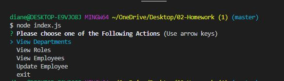
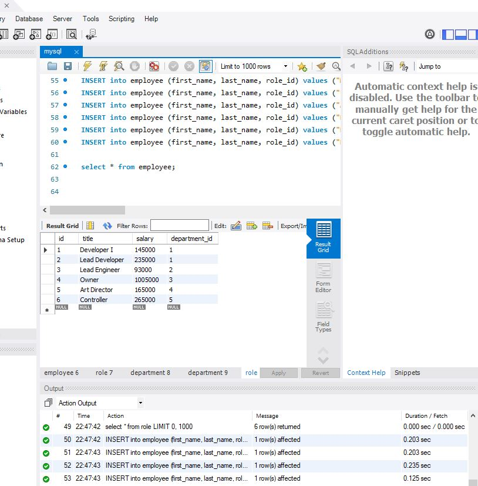

# Employee-tracker

## Description
This app was created to be used in the command line as a way to update, create, and delete employees portfolios. 

## Issues
So I ran into a snag. I am not sure why my program is not working, I keep getting an error saying that my package.json didnt have a respiratory, so a ran NPM INIT and made a new package.json and replaced it. Then I ran it again and said that it couldnt start, so I added a ""start:" index.js" in the package.json, and then I ran it again and I keep getting errors and I am not sure where my code it wrong. Below I have added pictures of my project a the errors I keep getting. 

## Pictures 
### This is the error I keep getting everytime I ran my code. 

### This is when I ran Node index.js into the command line. It would populate the question, but it would not allow the user to choose any of the options. 

### This is a picture of the table I create in Mysql Workbench 

